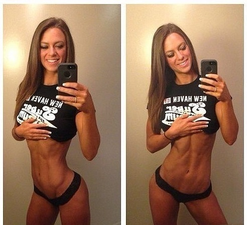

<html>
	<head>
		<title>Portal</title>
		<meta charset="UTF-8" />
		<meta id="viewport" name="viewport" content="width=device-width, user-scalable=no" />
		<link href="assets/css/style.css" rel="stylesheet" />
		
	</head>
	<body>
		

			

				

					<ul>
						<li><a href="./" class="ativo">Home</a></li>
						<li><a href="quem somos">Quem Somos</a></li>
						<li><a href="anuncie aqui">Anuncie Aqui</a></li>
						<li><a href="contatos">Contatos</a></li>
					</ul>
				

				

					<input type="Image" src="assets/imagens/lupa_branca2.png" title="Pesquisa" border="0" width="26" height="26" />
					<input type="text" name="busca" class="topobusca" placeholder="Busca..." />
					
					
					
					
					
				

			

		

		

			

				

					
				

				

				

			

		

		

			

				
				<ul id="menu">
					<li><a href="./" class="ativo">Home</a></li>
					<li><a href="./">Economia</a></li>
					<li>
						<a href="./">Entretenimento</a>
						
						

							<a href="./">
Cultura
</a>
							<a href="./">
Cinema
</a>
							<a href="./">
Moda
</a>
							<a href="./">
Música
</a>
						

					</li>
					<li>
						<a href="./">Esportes</a>
						
						

							<a href="./">
Futebol
</a>
							<a href="./">
Basquete
</a>
							<a href="./">
Outros...
</a>
						

					</li>
					<li><a href="./">Geral</a></li>
					<li>
						<a href="./">Noticias</a>
						
						

							<a href="./">
Politica
</a>
							<a href="./">
Policia
</a>
						

					</li>
					<li><a href="./">Polícia</a></li>
					<li><a href="./">Videos</a></li>
				</ul>
			

		

		

			

				

					

						ÚLTIMAS NOTÍCIAS
					

					

						Criador da internet teme a perda de todas as nossas memórias digitais no futuro.
					

				

			

		

		

			

				

					

						

							

							

							

							

						

						

							<a href="./">
								

									

										
Crossover da CW, "Crise nas Infinitas Terras" pode incluir Lúcifer!

										
O crossover Crise nas Infinitas Terras segue rendendo encontros entre os atores das séries do Arrowverso, mas um novo rumor pode ter expandido ainda mais o alcance dos episódios.

									

								

							</a>
							<a href="./">
								

									

										
Artista do Maranhão faz sucesso com seus desenhos.

										
Jovem faz desenhos de personagens famosos da cultura pop, usando PhotoFiltre.

									

								

							</a>
							<a href="./">
								

									

										
Superman vai ganhar novos poderes!!!

										
A DC Comics pretende dá novos poderes para o seu maior herói em nova Hq.

									

								

							</a>
							<a href="./">
								

									

										
Power Rangers vai ganhar um novo arco feito pela BOOM! studio.

										
Os heróis vão ganhar novos histórias já em novembro desse ano.

									

								

							</a>
						

					

					

						

							NOTÍCIAS
						

						

							

								<a href="./">
									

										

											
										

										

											Polícia Militar prende quadrilha com drogas e metralhadora na zona norte de Teresina.
										

										

											23 dia atrás	deixe um comentário.
										

									

								</a>
							

							

								<a href="./">
									

										

											
										

										

											Em retorno ao Minerão, Cruzeiro empata por 1 x 1 com a Caldense no Campeonato Mineiro.
										

										

											5 dias atrás	deixe um comentário.
										

									

								</a>
								<a href="./">
									

										

											
										

										

											Barack Obama é fragado tirando foto com o "pau de selfie"
										

										

											8 dias atrás	deixe um comentário.
										

									

								</a>
								<a href="./">
									

										

											
										

										

											Criador da internet teme a perda de todas as nossas mémorias digitais no futuro.
										

										

											15 dias atrás	deixe um comentário.
										

									

								</a>
								<a href="./">
									

										

											
										

										

											Novo modelo da sandália está próximo de ser lançado, diz chefe da MALTA.
										

										

											15 dias atrás	deixe um comentário.
										

									

								</a>
							

							

						

					

					

						

							ESPORTES
						

						

							

								<a href="./">
									

										

											
										

										

											Messi chega à 6º título da Chuteira de Ouro e recebe troféu Hoje.
										

										

											3 dia atrás	deixe um comentário.
										

									

								</a>
							

							

								<a href="./">
									

										

											
										

										

											Cristiano Ronaldo recebe mais por publicações no Instagram do que por jogar na Juventus.
										

										

											2 dias atrás	deixe um comentário.
										

									

								</a>
								<a href="./">
									

										

											
										

										

											LeBron James se envolve na disputa entre NBA e China.
										

										

											7 dias atrás	deixe um comentário.
										

									

								</a>
								<a href="./">
									

										

											
										

										

											Corinthians x Cruzeiro: veja desfalques e prováveis escalações.
										

										

											10 dias atrás	deixe um comentário.
										

									

								</a>
								<a href="./">
									

										

											
										

										

											Aos 42, Tom Brady não fala em aposentadoria, mas NFL vive com medo do dia chegar.
										

										

											15 dias atrás	deixe um comentário.
										

									

								</a>
							

							

						

					

				

				

					

						

							SOCIAL
						

						

							
							
							
							
							
						

					

					

						

							ÚLTIMAS NOTÍCIAS
						

						

							

								<a href="./">Epic Games:Já disponível gratuitamente: Alan Wake's American Nightmare and Observer.</a>
							

							

								<a href="./">Messi ganha sua 6º Chuteira de Ouro, é ser torna o único jogador a alcançar tal feito.</a>
							

							

								<a href="./">"Pessoas como ela são alicerces para que o melhor da moda não morra!"</a>
							

							

								<a href="./">Playstation demitiu dezenas de funcionarios no dia do anuncio do PS5.</a>
							

							

								<a href="./">O filtro do Coringa é o novo efeito que vem fazendo sucesso no Instagram Stories.</a>
							

						

					

					

						

							PUBLICIDADE
						

						

							<b>Controverso "Skilly Pills" atingiua internet.</b>
							
							<b>Eles são muito stong para ficar em lojas?</b>
						

					

					

						

							ENCONTRE-NOS NO FACEBOOK
						

						

							<iframe src="https://www.facebook.com/plugins/page.php?href=https%3A%2F%2Fwww.facebook.com%2FSoccerDolls%2F&tabs=timeline&width=275&height=500&small_header=true&adapt_container_width=true&hide_cover=false&show_facepile=true&appId=566890540721284" width="275" height="500" style="border:none;overflow:hidden" scrolling="no" frameborder="0" allowTransparency="true" allow="encrypted-media"></iframe>
						

					

				

			

		

	</body>
</html>
